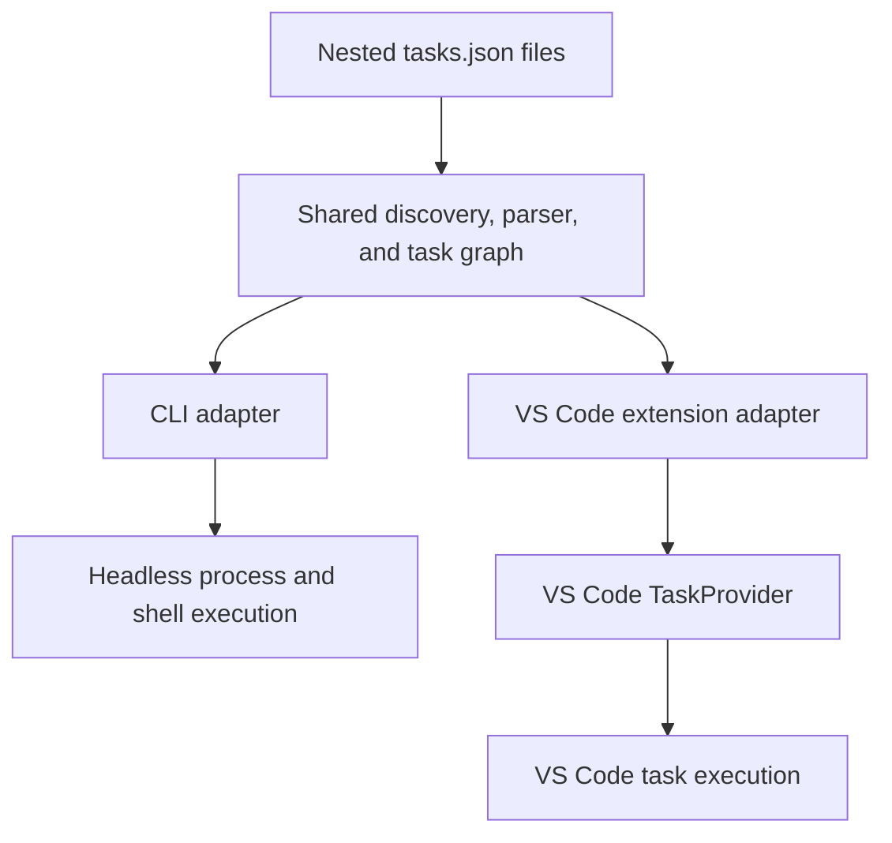

# vstask

`vstask` is a proposed task runner for recursively discovered VS Code `tasks.json` files. It is intended to make task definitions available from both a terminal and the VS Code task interface.

This document records the current design discussion. It is input for a future planning session, not a final implementation plan.

## Development Stage

The parser-to-CLI, discovery, exact-selection, candidate-ranking, interactive-selection, preparation, and process/shell-execution stages are implemented. They are not release-ready.
The three TypeScript packages build. The extension provides executable leaf tasks through the VS Code task interface.
The CLI lists, selects, and runs individual process and shell tasks from discovery roots or one explicit file.

```bash
cd vstask
npm ci
npm test
node packages/cli/dist/index.js list --file fixtures/listing/.vscode/tasks.json
node packages/cli/dist/index.js list --workspace fixtures
```

### CLI Framework

Existing and future CLI commands use Clipanion for command registration, arguments, options, help, and validation.
Task discovery, identity, and exact selection remain in the shared core. Fuzzy ranking belongs to the CLI adapter.
Do not add a separate CLI parser or command framework.
Use `--help` for the command list, or `list --help`, `select --help`, and `run --help` for command options.

### Installed Runtime Selection

After `npm run build`, use `packages/cli/bin/vstask` on macOS or
`packages\cli\bin\vstask.cmd` on Windows. These entry scripts can start without Node.js.
The npm command uses `bin/launch.cjs`; npm's generated command shim requires Node.js.
Direct calls to `dist/index.js` bypass runtime selection and are development commands.

Set `VSTASK_RUNTIME` to an executable path to select it explicitly. Relative paths
are relative to the current directory. A missing, unsupported, or prerelease explicit
runtime fails without PATH fallback. Without an explicit path, the selector checks
Node.js, Bun, then Deno on PATH and selects the first supported runtime.

The initial stable support baselines are:

- Node.js 22.16.0 or later in the 22 LTS line, or 24.0.0 or later in the 24 LTS line.
- Bun 1.2.0 or later.
- Deno 2.4.0 or later.

The selector reports the runtime, version, and executable on stderr. It leaves CLI
stdout and task streams unchanged. A failed version probe or unavailable runtime
stops before task startup and reports installation guidance. Probes have a three-second
timeout. Once the CLI starts, failure never causes a retry with another runtime.
No runtime is bundled or installed. Later Node.js lines require a reviewed policy update.

Deno uses `run --allow-all --no-prompt --quiet` because the CLI reads task files,
inherits the environment, and starts task processes. The entry scripts use an
installed Node.js 16+, Bun 1+, or Deno 2+ only to load the TypeScript selector;
this does not make an older runtime a supported task runtime.

Controlled launcher checks run on macOS. Complete runtime conformance on macOS and
Windows remains a separate release gate. Extension packaging and external command
installation are not implemented by this stage.

### Discovery

`vstask list` searches the current directory for root and nested `.vscode/tasks.json` files.
Use repeated `--workspace <directory>` options to search separate discovery roots.
The shared `discoverTaskFiles(roots, options)` API retains each file's discovery root,
including separate records for overlapping roots.

Discovery excludes directories named `.git` and `node_modules` at every depth.
Use repeated `--exclude <directory>` options to add exclusions.
A directory name excludes that name at every depth; a path excludes a directory relative to each root.
Use `/` between path components. Exclusions are literal directory names or paths, not glob patterns.
Use `--no-default-excludes` to disable the defaults while retaining configured exclusions.
In core, pass `exclude` and `useDefaultExclusions: false` for the same controls.

Discovery does not follow directory links or apply Git-ignore rules.
Listing never starts tasks. File errors currently stop listing; partial results and error reporting remain pending.
`--file` cannot be combined with discovery options.

### VS Code Catalog Refresh

The extension uses shared discovery and watches task-file additions, edits, and removals.
The next task request uses the updated catalog without an extension restart.
Refresh preserves unchanged canonical identities and does not stop or restart active tasks.
Workspace-folder changes also refresh the catalog.

Each workspace folder can configure these resource-scoped settings:

- `vstask.roots`: discovery directories, absolute or relative to the workspace folder. The default is `["."]`. An empty array disables discovery for that folder. Repeated root paths are discovered once.
- `vstask.exclude`: additional directory names or relative paths, with the same literal matching rules as CLI exclusions.
- `vstask.useDefaultExclusions`: defaults to `true`. Set it to `false` to include `.git` and `node_modules` while retaining configured exclusions.

Setting changes rebuild the file watchers and refresh discovery. They do not authorize automatic task execution.
Run `npm run test:extension` for the pinned extension-host catalog and execution checks.
The catalog checks change temporary task files and settings while a native task remains active.
macOS validation is complete for this stage; Windows integration remains required before release.

### VS Code Task Groups

The shared parser retains normalized `group.kind` and `group.isDefault` metadata
without changing the source configuration. It accepts build, test, clean, and rebuild
string or object groups, legacy build/test flags, and pinned build/test label inference.

Discovered build and test tasks use the standard VS Code commands. Boolean defaults
apply unless a filename-pattern default matches the active file. Patterns use the
file path relative to its open VS Code workspace folder. Multiple matching defaults
remain separate choices. A nonmatching file, no active editor, or an untitled editor
uses boolean fallback. Default flags are resolved on each task request.
Duplicate labels retain canonical identities and display file-qualified selectors
in task details. Group commands do not change task files.
The pinned macOS host checks pass; Windows verification remains a release gate.

### Exact Selection

Listing writes four tab-separated columns: label, source location, canonical identity, and file-qualified selector.
The source location uses `file:line:column`, with one-based character positions.

The canonical identity is `vstask:<root>:<file>:<label>`.
Each component is encoded with `encodeURIComponent`.
The root is the absolute discovery-root path. The file is relative to that root and uses `/` separators.
Different discovery roots retain different identities, including overlapping roots.
For `--file`, the root is the parent of the file's `.vscode` folder.

A file-qualified selector uses `<relative-task-file>#<encoded-label>`.
For example, `apps/client/.vscode/tasks.json#build` selects `build` in that file when the reference is unique.
Use a listed canonical identity to distinguish the same file-qualified selector in different roots.

```bash
node packages/cli/dist/index.js select 'fixture:build' --file fixtures/listing/.vscode/tasks.json
node packages/cli/dist/index.js select 'apps/client/.vscode/tasks.json#build' --workspace .
```

Use Clipanion's `--` separator before a selector that looks like an option.
Put command options before the separator:

```bash
node packages/cli/dist/index.js select --workspace . -- '--release'
```

`select` reports one selected task in the listing format. It does not plan or execute a task.
An exact canonical identity takes priority over short selectors.
An exact label or file-qualified selector must match one canonical identity.
Ambiguous selectors return the usable canonical identities on stderr, no selected task on stdout, and exit code 1.
Missing selectors also return exit code 1.
Repeated discovery of one canonical identity does not make selection ambiguous.

The shared core exports `identifyTask(discoveryRoot, task)` and `selectExactTask(tasks, selector)`.

### Fuzzy Candidates

Use `select --fuzzy` to list ranked candidates without execution:

```bash
node packages/cli/dist/index.js select aspire --fuzzy --workspace .
node packages/cli/dist/index.js select aspre --fuzzy --threshold=0.3 --workspace .
```

Exact canonical identities and unique exact selectors take priority. Ambiguous exact
selectors remain errors. Otherwise, Fuse.js searches labels and file-qualified names
without a location penalty. It deduplicates canonical identities and orders candidates
by score. Equal-score candidates have no specified order.

The default threshold is `0.3`. `--threshold` accepts a number from `0` to `1` and
requires `--fuzzy`. Lower values permit fewer typing errors; the threshold is not an
edit count. A threshold of `0` still permits exact substrings. Blank or unrelated
queries with no candidates return exit code `1` with no task rows.

Rows use the same four columns as listing. Multiple candidates are listed, not run.
The CLI adapter exports `rankCliTasks(tasks, query, threshold?)`, which returns task
identities with scores. Smaller scores come first.
These functions preserve the parsed configuration and source location for later planning.

### Run Selection

When stdin and stdout are terminals, `run` permits partial names and typing errors.
It displays one fuzzy match on stderr and runs it immediately. Multiple fuzzy matches
or duplicate exact labels require an Inquirer menu choice. The menu shows canonical
identities. Cancellation returns a nonzero exit code without starting a task.

Without an interactive terminal, `run` requires an exact selector unless `--fuzzy`
is supplied. Ambiguity returns candidate identities on stderr and exit code `1`.
It never prompts or starts tasks. Exact canonical identities and unique exact
selectors retain priority in both modes. `--threshold` sets the fuzzy threshold;
non-interactive runs require `--fuzzy` with this option.

```bash
node packages/cli/dist/index.js run aspire --workspace .
node packages/cli/dist/index.js run aspre --fuzzy --threshold=0.3 --workspace .
```

Selection resolves to one canonical task before preparation and startup. Successful
selection preserves the selected task's output streams and exit code. The CLI adapter
exports `runCli(args, context?)` for callers that supply input and output streams.

### Native and Extended Dependency Planning

The core exports `planNativeTask(tasks, selectedTask)`. It returns a graph with `task`,
`dependsOrder`, and ordered `dependencies` on each node. It does not start tasks.
Only the selected task and its reachable dependencies are validated.

String references resolve exactly in each source task file and discovery root.
Labels take priority over `identifier` aliases. The last duplicate in task-file order
wins, as in the pinned resolver with a complete task list. A complete local reference
takes priority, including a literal `ws:build` label.

An unmatched `ws:build` reference requests exact label lookup across task files in
the source discovery root. It must select one canonical task identity. Use
`ws:<relative-task-file>#<encoded-label>` to select a file when labels are duplicated
or a local `ws:` label would otherwise win. For example,
`ws:tools/.vscode/tasks.json#build` selects `build` in that task file.
Use `ws:<canonical-identity>` if a complete local label or identifier blocks a
file-qualified reference. Canonical references remain limited to the source root.
Canonical references take priority over file-qualified references, which take
priority over recursive labels. Dependencies never use fuzzy matching, prompts,
or cross-root lookup. Ambiguous references report usable qualified references.
If local labels or identifiers block both forms for a target, the diagnostic
reports the collision instead of suggesting a reference to the wrong task.
Duplicate entries within one file retain the last-entry rule.

`dependsOrder: "sequence"` preserves sequence order. Other values use parallel order.
Repeated and shared dependencies refer to the same plan node. Executors must use one
dependency result per node within a run. Missing targets, ambiguous references, and
cycles produce source-located errors before a plan is returned. Dependencies of
unselected tasks are not traversed.
Task-definition object references, invalid-file lookup safeguards, and adapter
execution remain pending.

### Input Preparation

`resolveCliTaskPlan(tasks, selected, context?)` and
`resolveVSCodeTaskPlan(tasks, selected, context?)` return promises. Await preparation
before starting any task in the returned plan. The core API is
`resolveTaskPlanInputs(plan, context?)`. The synchronous variable-only APIs remain
available for callers that already have all variable values.

Parsed tasks retain their source file's `inputs` definitions. Only the selected
plan is resolved. The last definition with a matching input ID takes priority.
Repeated references are evaluated once per task, including references introduced
by nested substitutions. Shared dependency nodes remain shared.

For CLI preparation, supply `inputs` as repeated `id=value` entries:

```ts
const plan = await resolveCliTaskPlan(tasks, selected, {
	interactive: false,
	inputs: ['target=dev', 'tools/.vscode/tasks.json#target=prod'],
});
```

The first `=` separates the input ID from its value. Further `=` characters and
whitespace remain in the value. `id=` supplies an empty string. The last repeated
assignment takes priority. A file-qualified key uses
`<relative-task-file>#<encodeURIComponent(input-id)>` and takes priority over a
bare ID. Bare IDs apply in each source file that defines that input. Both adapters
also accept the same keys in `context.inputValues`.

Supplied values take priority over configured defaults and do not prompt.
Non-interactive preparation uses configured defaults for other required inputs.
A missing value, invalid choice, invalid definition, or canceled prompt rejects
preparation before any selected-plan startup. Errors include the task source
location, not supplied values. Only configured values are valid for `pickString`.

The CLI uses Inquirer for `promptString`, password masking, and `pickString`.
Enter accepts a configured default; password defaults are not displayed.
Interactive mode defaults to terminal availability. Set `interactive: false` for
automation or machine-readable output. `promptInput(input, task)` permits a host
to supply its own prompt controls; the VS Code adapter requires that callback for
interactive preparation.

Command inputs use a supplied value or an explicit
`resolveInputCommand(command, args, task)` callback. Arguments are passed unchanged,
as in the pinned evaluator. The callback must return a string. No provider is
installed, invoked automatically, or recreated through a standalone extension
runtime. Unavailable command values fail before startup.

These preparation APIs return resolved values in memory. They do not log values
or start tasks. `list` and `select` remain discovery commands and do not accept
input assignments. VS Code provider registration remains pending.

### Editor Context

The CLI does not read or guess editor state. Supply required values with repeated
`--context name=value` options or `--context-file <path>` on `run`:

```bash
node packages/cli/dist/index.js run build --workspace . --context file=src/example.ts --context lineNumber=3
node packages/cli/dist/index.js run build --workspace . --context-file editor-context.json
```

The context file is a JSON object with these optional fields:

```json
{
	"file": "/project/src/example.ts",
	"fileWorkspaceFolder": "/project",
	"selectedText": "selected value",
	"lineNumber": 3,
	"columnNumber": 5
}
```

Use platform-native paths. Relative file and folder paths use the CLI current
directory, not the context-file directory. Files need not exist for path-variable
resolution. Position values are positive, one-based integers; JSON positions must
be numbers. The first `=` separates an option name from its value. Further `=`
characters and whitespace remain in the value. The last repeated assignment wins.
Options override context-file values. Unsupported field names and unreadable or
invalid JSON files stop preparation without task startup.

Only the selected plan's required fields are resolved. Missing or invalid required
values produce source-located errors with context-option guidance. Unselected
tasks do not require context. A task that does not need editor state can run with
no supplied context. Preparation finishes for the complete selected plan before
any process can start. Supplied text is not included in preparation diagnostics.

| Variable | Effect and Required Context |
| --- | --- |
| `${file}` | Absolute active-file path from `file`. |
| `${fileDirname}`, `${fileDirnameBasename}` | File directory path or its final name, from `file`. |
| `${fileExtname}` | Final file extension, including its dot, from `file`. |
| `${fileBasename}`, `${fileBasenameNoExtension}` | File name with or without its final extension, from `file`. |
| `${relativeFile}`, `${relativeFileDirname}` | File or directory path relative to the task workspace folder, from `file`. A directory at that folder resolves to `.`. |
| `${fileWorkspaceFolder}`, `${fileWorkspaceFolderBasename}` | The explicitly supplied `fileWorkspaceFolder` path or its final name. It can differ from the task workspace folder. |
| `${selectedText}` | Nonempty selected text, supplied as `selectedText`. |
| `${lineNumber}`, `${columnNumber}` | One-based selection-start position, supplied as `lineNumber` and `columnNumber`. |

Both adapter preparation APIs accept `context.editorContext` with the same fields.
Relative-file variables also accept a named folder, such as `${relativeFile:tools}`,
when the host supplies the corresponding `context.workspaceFolders` entry.
The CLI does not infer a workspace-folder map from an editor-context file.
The existing `resolveEditorVariable` callback can supply host-specific values instead.

VS Code uses the active editor at task execution time, not at task listing time.
It supplies the saved file path, the containing open workspace folder, selected
text, and selection-start position. An untitled editor supplies selection and
position values but no saved file path. No active editor or an empty selection
cannot supply required editor values. These checks pass in the pinned macOS host;
Windows integration remains a release gate.

### Task Execution

`run` selects one exact task, prepares its command and inputs, and starts a process
or shell task. Process tasks do not use a shell. The discovery options are the same as for `list` and `select`.
Supply input values with repeated `--input id=value` options:

```bash
node packages/cli/dist/index.js run build --workspace . --input target=dev
```

Shared preparation applies file-level command defaults and active `osx`, `windows`,
or `linux` command overrides before variable resolution. Modern platform arguments
replace base arguments. Platform environment entries merge with base entries.
A task with its own command does not inherit global arguments. A task environment
takes priority over the complete global environment, rather than merging with it.
Relative cwd values use the task workspace folder. An explicitly empty cwd uses
the user home, as in the pinned terminal executor.

The shared `runProcessTask(preparedTask, context?)` API accepts a resolved task.
Context can supply `environment`, `platform`, `userHome`, `stdin`, `signal`, and `onEvent`.
Pass the same environment and platform context used during preparation.
Quoted command and argument values become literal process values; quote metadata
does not add shell quotes. Standard input is forwarded. Output events carry raw
bytes and identify stdout or stderr. Start events include the task identity and PID.
Startup errors omit resolved commands and supplied values. One completion event
follows stream closure and contains `status`, `exitCode`, `signal`, and an optional
startup error. Startup failure has no task exit code. The CLI returns 1 for startup
or preparation errors and otherwise returns the process exit code.

Shell tasks use the same API, streams, environment, cwd, and completion contract.
`options.shell` supplies the executable, arguments, and optional quoting rules.
Shell fields inherit from file defaults and active platform blocks individually.
An explicit executable requires explicit command switches, such as `args: ["-c"]`
for Bash or `args: ["/d", "/c"]` for cmd. No switches are added for an explicit executable.
Without one, the CLI uses `SHELL` or `/bin/sh` on POSIX and `powershell.exe` on Windows,
and adds the pinned shell command switches. This is a headless default, not a VS Code terminal profile.

String commands and arguments follow the pinned automatic quoting rules. Quoted
value objects select `strong`, `weak`, or `escape`; they are not process literals.
Command-only strings retain shell expressions. Empty raw arguments and empty quoted-value
objects do not create an empty shell argument. Use the quoted string `"\"\""` to pass one.
See the [shell baseline](BASELINE.md#shell-startup) for the platform rules and test limits.

This stage rejects provider, background, and dependency execution before
startup. It does not provide NDJSON, problem
matching, or installed VS Code providers. Legacy execution conformance and actual
Windows and VS Code integration remain pending. This stage is not release-ready.

### Cancellation

Pass an `AbortSignal` as `context.signal` to cancel shared execution. An already
aborted signal starts no process. Active cancellation stops the owned process
tree, including descendants in separate process groups. Completion reports
`status: 'cancelled'` and `exitCode: null` after cleanup. Cleanup errors retain
the cancelled status and add a safe source-located `error`. Such an error means
cleanup could not be confirmed. Termination attempts continue for the other
recorded processes. Cancellation does not restart tasks.

CLI `run` handles `SIGINT` and `SIGTERM`, waits for cleanup, and writes
`Task cancelled.` to stderr. Its cancellation exit codes are 130 and 143 respectively.
VS Code custom tasks connect task termination to the same executor. Native tasks
retain VS Code termination behavior. Unrelated processes and task executions remain active.

POSIX tasks use isolated process groups and `pidtree` descendant lookup. Windows
uses `taskkill /T /F` for owned-tree termination. The public executor, CLI signal,
and pinned VS Code host contracts passed on macOS. Actual Windows process-tree
and console-interruption checks remain required; this stage is not release-ready.

See the [baseline record](BASELINE.md) for imported code, license notices, and the reviewed update procedure.
See the [fixture inventory](fixtures/README.md) for verified behavior and pending compatibility work.

The approved tracker records replace conflicting recommendations below.
In particular, `${workspaceFolder}` means the parent of the discovered `.vscode` folder,
and the first release requires complete built-in task behavior in both adapters.

## Original Design Input

## Problem

VS Code discovers `.vscode/tasks.json` only at a workspace root. It does not discover task files in nested projects unless each project is added as a workspace folder.

Large workspaces can contain several related projects. Keeping all tasks in one root file creates a central file that is difficult to own and maintain. Adding every nested project as a workspace folder also changes the Explorer layout and workspace behavior.

The desired behavior is:

- Discover nested `.vscode/tasks.json` files recursively.
- Show discovered tasks in the standard VS Code **Run Task** interface.
- Run the same tasks from a CLI when VS Code is not open.
- Give tools such as Copilot a stable, headless command with useful output and exit codes.
- Keep parsing, dependency planning, and task identity consistent in both modes.

## Two execution paths

The system has one shared core and two runtime adapters.



### Headless CLI

The CLI must work with no VS Code process or extension host. It owns process execution and exposes commands such as:

```bash
vstask list
vstask run workflow-aspire:start-aspire
vstask run workflow-aspire:start-aspire --json
```

The CLI adapter is responsible for:

- Shell and process startup.
- Standard input, output, and error streams.
- Exit codes.
- Sequential and parallel dependencies.
- Failure propagation.
- Cancellation and process-tree termination.
- Machine-readable output for agents and scripts.

The CLI does not try to open VS Code or communicate with a running extension. This keeps it suitable for agents, automation, and headless environments.

### VS Code extension

The extension discovers the same files through the shared core and registers a `vscode.TaskProvider`. It converts normalized leaf tasks into `vscode.Task` instances and runs them with `vscode.tasks.executeTask()`.

This delegates the following behavior to VS Code:

- Integrated terminal creation and reuse.
- Named problem matchers.
- Task status and lifecycle events.
- Presentation settings.
- Task cancellation.
- Entries in the standard **Run Task** picker.

The extension should contain only the VS Code adapter, user commands, refresh handling, and task-provider registration. Task parsing and planning belong in the shared core.

## Shared core

The core must not import the VS Code extension API. Both adapters use it directly.

Its responsibilities are:

- Find nested `.vscode/tasks.json` files.
- Parse JSON with comments.
- Apply platform-specific configuration.
- Resolve variables that do not require a user interface.
- Normalize task definitions into one internal model.
- Assign stable task identifiers.
- Resolve `dependsOn` references.
- Detect missing dependencies and cycles.
- Create sequential or parallel execution plans.
- Define common failure and cancellation behavior.

A stable identifier should include the task file path and task label. Labels alone are not unique in a recursive workspace. A possible display form is:

```text
workflow-aspire:start-aspire
```

The internal identity should retain the full relative task-file path to prevent ambiguity.

## Parser source

VS Code is open source under the MIT license. The parser can be forked from the VS Code task implementation and adapted into the shared core.

The fork must:

- Retain the required upstream license notice.
- Remove dependencies on VS Code workbench services.
- Record the upstream commit used for each import or update.
- Add compatibility tests based on representative `tasks.json` fixtures.
- Make upstream updates explicit instead of silently depending on private VS Code modules.

Forking the parser provides better format compatibility than writing an unrelated parser. Forking the complete VS Code executor is not required for the extension path because VS Code can execute normalized leaf tasks. The CLI adapter still needs a standalone executor.

## Compound tasks

The public `vscode.Task` API has no `dependsOn` or `dependsOrder` properties. A task provider cannot pass a dependency graph to VS Code directly.

The shared core therefore owns dependency planning in both modes.

For the CLI, the CLI adapter executes each planned leaf task as a child process. For VS Code, the extension executes each planned leaf task through `vscode.tasks.executeTask()` and waits for task lifecycle events.

To show a compound task in the standard task picker, the extension can publish a task that uses `vscode.CustomExecution`. Its custom execution coordinates the child `TaskExecution` instances and terminates them when the parent is cancelled.

This makes dependency behavior common across both adapters while leaf execution remains native to each environment.

## Workspace and path semantics

Recursive discovery makes path meaning important. The planning session must define these rules before implementation.

Recommended starting rules:

- The CLI receives a workspace root from `--workspace` or uses its current directory.
- The extension treats each open VS Code workspace folder as a discovery root.
- `${workspaceFolder}` continues to mean the discovery root, not the directory that contains the nested task file.
- Task identity and dependency lookup are scoped to the discovery root.
- A separate variable can be added later if tasks need the task-file directory.

These rules preserve the meaning of `${workspaceFolder}` in an existing root task when that task file is moved into a nested project directory.

## Initial compatibility target

The first useful version should support:

- `shell` and `process` tasks.
- `label`, `command`, and `args`.
- `options.cwd` and `options.env`.
- `windows`, `linux`, and `osx` overrides.
- Named problem matchers in VS Code.
- `group`, `presentation`, and `runOptions` where the adapter supports them.
- `dependsOn` and `dependsOrder` through the shared planner.
- Common predefined variables.
- Refresh when a nested task file changes.

Features that need separate design include:

- `inputs` and interactive prompts.
- Command variables supplied by other VS Code extensions.
- Inline problem matchers in headless mode.
- Background task readiness detection.
- Automatic `folderOpen` execution for nested files.
- Exact terminal presentation parity in CLI mode.

The two adapters do not need identical presentation. They must agree on task selection, dependency order, command arguments, environment, failure, cancellation, and final status.

## Suggested package layout

```text
vstask/
|-- packages/
|   |-- core/
|   |-- cli/
|   `-- vscode-extension/
|-- fixtures/
`-- README.md
```

`core` contains discovery, the forked parser, normalization, variable handling, and planning. `cli` contains the headless executor and command-line interface. `vscode-extension` contains the task provider and VS Code execution adapter. `fixtures` contains shared compatibility and conformance cases.

## Validation strategy

Each fixture should be parsed once by the shared core. Adapter tests should then verify that both runtimes receive the same normalized task and execution plan.

Important contract cases are:

- Duplicate labels in different nested task files.
- Relative and absolute working directories.
- Platform overrides.
- Sequential and parallel dependencies.
- Dependency failure and cancellation.
- Cyclic and missing dependencies.
- Quoting of commands and arguments.
- Environment-variable inheritance and overrides.
- Long-running background tasks.

VS Code integration tests should verify that provided tasks appear in the standard picker, use integrated terminals, report named matcher problems, and stop child executions when a compound task is cancelled.

## Planning questions

The future planning session should decide:

1. Which VS Code commit and files become the parser baseline?
2. Is full task-schema compatibility required, or is a documented subset acceptable?
3. How are nested task identifiers displayed and referenced by `dependsOn`?
4. Can dependencies cross task files and workspace roots?
5. Which variable forms must work in the first release?
6. How does the CLI represent interactive inputs in non-interactive mode?
7. How much problem-matcher behavior must the CLI reproduce?
8. How are background tasks declared ready and later terminated?
9. Which structured output contract should Copilot and other agents consume?
10. How will parser changes from upstream VS Code be reviewed and merged?

## Proposed delivery order

1. Define the normalized task model and workspace semantics.
2. Import and isolate the VS Code parser with fixture tests.
3. Add recursive discovery and stable identifiers.
4. Implement the CLI leaf executor.
5. Add dependency planning and compound execution.
6. Implement the VS Code task provider and leaf adapter.
7. Add shared conformance tests for both adapters.
8. Add advanced variables, inputs, background tasks, and problem matching as required.